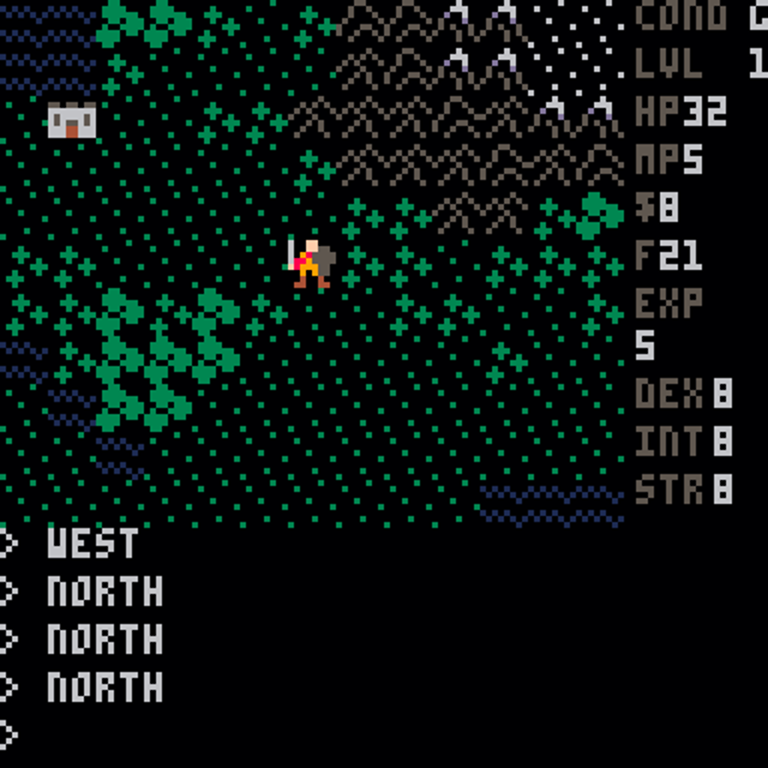
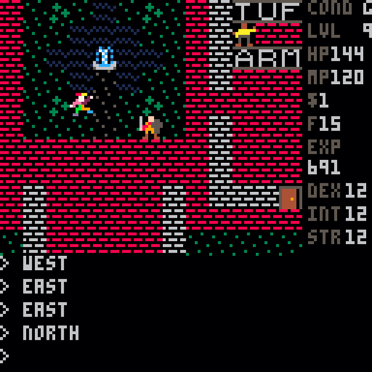
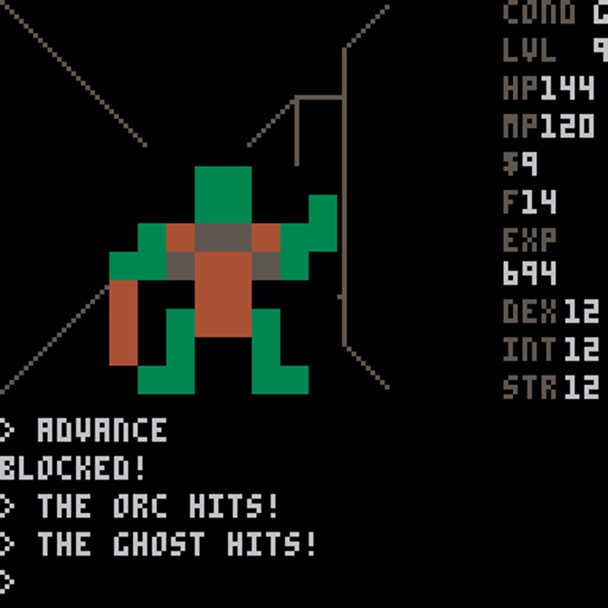
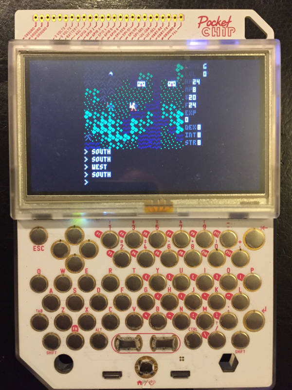
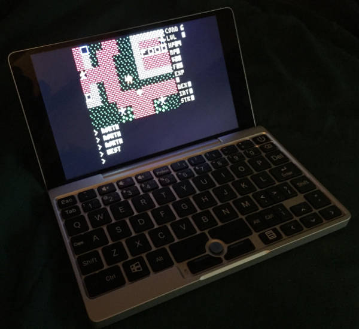

Minima
======

*My homage to the 8-bit Ultima games.*

What Is It?
-----------

Minima is an adventure RPG in the style of the older Ultima games as played on the
Commodore 8-bit computers. Just like the original Ultima games, it includes a world
view, enterable towns, and 3D dungeon displays. It also features graphics, sound
effects, and music that should help one recollect those classics. More importantly,
it is a fully playable (and winnable) game with its own backstory, plot, setting, and
characters.

You can play it online on the `Minima at Lexaloffle page`_ or play it directly through
any PICO-8 environment by using the `splore` utility.

Screenshot of the world view in Minima. There's a town to the northwest, mountains to
the northeast, and plains to the south.

Screenshot of the town view in one of Minima's towns. A fountain, merchant, and jester
are all present.

Screenshot of the dungeon view in one of Minima's dungeons. The player is being
attacked by both an orc (shown directly ahead) and a ghost (from behind). Yikes!

What Is It About?
-----------------

Figuring this out is part of the game. You're in the land of Miskatonia and you start
out within sight of a town and a dungeon. It's recommended that you try the town first.
Also, you start off without any weapons or armor, and this is a very precarious situation
to be in. You'll want to rectify it as quickly as possible. If you've not done so yet,
you should peruse the manual and get some tips about surviving in Miskatonia and some
warnings about the Faxon as well as basic information about game controls. If you are
too impatient to skim through the manual, the basic game controls are accessible from
within the pause menu of the game itself. Pressing the `p` key (or the `enter` key on
some platforms) should bring up this menu.

Origins (yes, I know it's a pun)
--------------------------------

As a kid I enjoyed playing the 8-bit `Ultima games`_ on the `C64`_ and `C128`_. First
there was `Ultima II`_ with its multiple worlds, time-travel, and challenge in the
Time of Legends. Then there was `Ultima III`_ with its smaller space but better
graphics and gameplay, and its mystery around Exodus. Then came `Ultima IV`_, with a
much bigger space and much better story, and an early prominent use of the word "avatar".
Then was the somewhat belated release of `Ultima I`_ for those who wanted more details
on the backstory. Then came `Ultima V`_, which not only improved upon the storytelling
in Ultima IV, but also took great advantage of the C128 hardware and provided what
I'd argue to be one of the best gaming experiences on the system. Then came `Ultima VI`_,
which was a disappointment on the C128 and essentially unplayable. The less
said about that one, the better.

I never got into Ultima again after #6, but I still have fond memories of playing
it. I noticed that `GOG`_ was making Ultima IV available again right around the same
time I'd started tinkering around with `PICO-8`_ on the `PocketC.H.I.P.`_, and while
porting `xu4`_ to the PocketC.H.I.P. as part of `PocketInstaller`_, I got a wild idea:
why not try to make a full game inspired by the old-school Ultimas within the
restrictive limits imposed by PICO-8? This project is the result of my efforts, an
homage to all the old 8-bit Ultima games, but especially numbers II through V.

Status
------

This project is at version 1.1. It should be completely playable from beginning to end.

Many features of the Ultima series as played on the C128 work. You can move around
and explore the world map and enter towns and dungeons. Town views and dungeon views
both work, and dungeons require torches to see. Looking at things and searching for
things works. Checking status works. Creature movement and behavior works. Combat
works in both world and dungeon views. Dialog with townies works.
Purchasing in towns works. Spells work. Capturing pirate ships works, and with one
it's possible to explore the waters of the world map. Leveling up works. Sound effects
are in place. The in-game help screen works. Saving and loading games works, although
it has some unavoidable limitations. Background music works. Increasing attributes
works. Fountains work. It's winnable.

Compared to the earlier version 1.0, version 1.1 features improved creature movement,
guild shops with working keys and torches, more townies with more clues, openable
treasure chests, more challenging dungeons, a tower puzzle, enterable shrines, and
many minor bugfixes.

Due largely to the existence of chests and additional dungeon levels, this version
requires less grinding; due largely to the existence of more characters, this version
has a bit more story. It is much closer to what I had set out originally to build.

Supported Platforms
-------------------

Minima will run everywhere that PICO-8 runs. By design it does not require the latest
& greatest version of PICO-8, so it'll even run on PocketC.H.I.P.

Photograph of Minima running on a PocketC.H.I.P.

Photograph of Minima running on a GPD Pocket Ubuntu Laptop

Challenges
----------

The constraints of building something within the PICO-8 environment make a project like
this fairly tough. This game pretty much maxes out PICO-8 capacity; there's not a
lot of space left and I'll likely have to trim out some already-started features to
shoehorn in anything else. All the PICO-8 graphic space (both for sprites and maps) are
fully used. All but a couple of the sound effects slots are used. The final version here
is a careful balance between maxing out the token count and the compressed size. The raw
size is already too large to fit without minimization, too, and even with that many
manual tweaks are required making the code quite ugly in places.

Building Minima
---------------

Normally PICO-8 applications are written in a special dialect of Lua and are immediately
interpreted within the PICO-8 environment without any special build steps. Minima is a
little larger and more complicated than most PICO-8 applications, and it is too large to
run directly without a special minimization step. The `picotool`_ utility does most of
what's needed, but at the moment unless this `special branch of picotool`_ is run with the
`luamin2` argument, it'll break Minima.

You can also substitute in triplefox's version of the music. It's less like the original
Commodore versions of the Ultima games but does a better job of making the most of what
is available within the PICO-8 environment. It's in the `alt_music.p8` file. To use it,
just copy over the existing `__sfx__` and `__music__` sections in `minima.p8` with the
corresponding versions found in `alt_music.p8`.

Other Notes
-----------

I build this with lots of respect and love for the original Ultima series. I make no
claims of any rights to any of the intellectual property associated with it. Hopefully
even my choice of naming this "Minima" (as opposed to "Ultima", get it?) helps convey
this notion.

The graphics and sound effects in it are based on my undoubtedly incomplete memories
of the original games and are deliberately trying to convey the feel of playing those
games on the C64/128 as I experienced them, not be pixel-perfect representations of what
they really were. I've drawn everything by hand and created the sound effects on my own,
so while they have all been strongly influenced by those original games I expect they'll
look quite a bit different if compared side-by-side, so please don't bother to complain
if you don't think something looks or sounds quite right.

The music is an attempt to recreate a little of the music that appeared in the Commodore
version of Ultima III. This was done with a combination of viewing various scattered
notes I found online with listening to recordings of the Commodore SID files. I couldn't
fully match the time signatures used as the originals are fairly long, fairly complex,
and do some pretty clever things. They also occasionally go outside the pitch range
available to PICO-8. Again, it's more about capturing the spirit than being a faithful
recreation.

This version makes use of Tyler Neylon's `json.lua`_ routine to parse JSON data; thanks
to freds72 for his reference to it.

The additional `Lua`_ utility script `convert.lua` is used to make it easier to lay out
a dungeon map and turn it into something the game can use.

.. _Minima at Lexaloffle page: https://www.lexaloffle.com/bbs/?tid=31831
.. _Ultima games: https://en.wikipedia.org/wiki/Ultima_(series)
.. _Ultima I: https://en.wikipedia.org/wiki/Ultima_I:_The_First_Age_of_Darkness
.. _Ultima II: https://en.wikipedia.org/wiki/Ultima_II:_The_Revenge_of_the_Enchantress
.. _Ultima III: https://en.wikipedia.org/wiki/Ultima_III:_Exodus
.. _Ultima IV: https://en.wikipedia.org/wiki/Ultima_IV:_Quest_of_the_Avatar
.. _Ultima V: https://en.wikipedia.org/wiki/Ultima_V:_Warriors_of_Destiny
.. _Ultima VI: https://en.wikipedia.org/wiki/Ultima_VI:_The_False_Prophet
.. _C64: https://en.wikipedia.org/wiki/Commodore_64
.. _C128: https://en.wikipedia.org/wiki/Commodore_128
.. _GOG: https://www.gog.com/game/ultima_4
.. _PICO-8: https://www.lexaloffle.com/pico-8.php
.. _PocketC.H.I.P.: https://en.wikipedia.org/wiki/CHIP_(computer)#Pocket_CHIP_and_Pockulus
.. _xu4: http://xu4.sourceforge.net/
.. _PocketInstaller: https://github.com/Feneric/PocketInstaller
.. _picotool: https://github.com/dansanderson/picotool
.. _special branch of picotool: https://github.com/Feneric/picotool
.. _json.lua: https://gist.github.com/tylerneylon/59f4bcf316be525b30ab
.. _Lua: https://www.lua.org/docs.html
